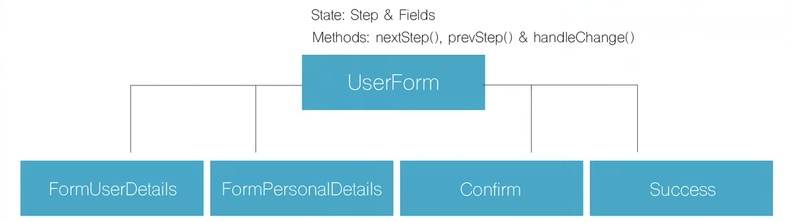

# Step Form

## You can see live demo in https://westamz.github.io/react_step_form/
This project is dividing in four steps
-   User information
-   Personal information
-   Confirmation the inserted data
-   Success with sending the data

## Components Structure

